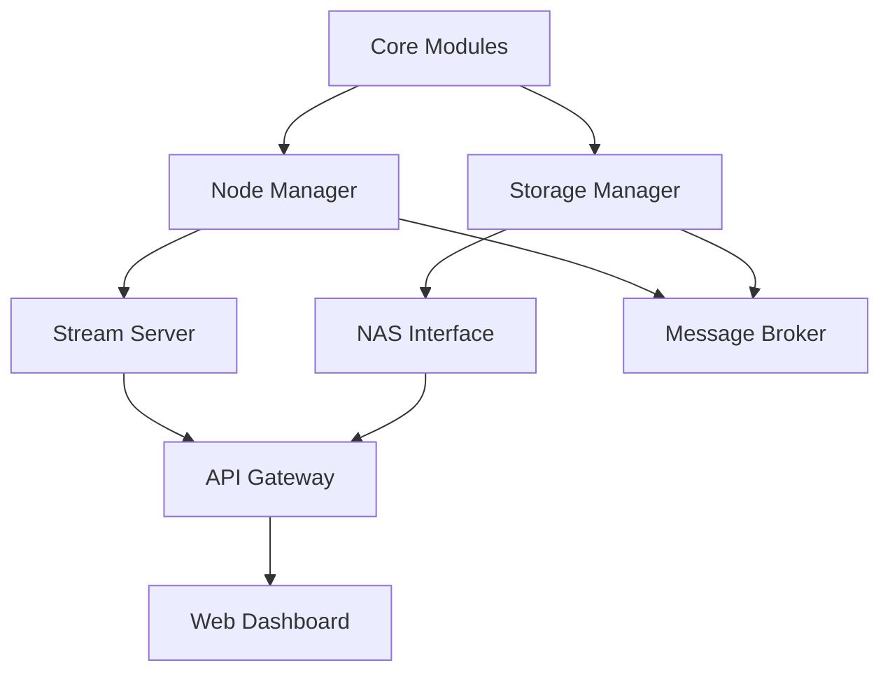

# 분산 CCTV 시스템 단계별 구현 로드맵

## 전체 구현 전략
**목표**: 현재 단일 노드 시스템을 점진적으로 분산 시스템으로 확장
**기간**: 총 12주 (3개월)
**접근**: 애자일 방식, 2주 스프린트

## Phase 0: 준비 단계 (1주)

### 목표
현재 시스템을 모듈화하여 확장 가능한 구조로 리팩토링

### 작업 내용
```
Week 1:
├── 현재 코드 리팩토링
│   ├── 카메라 모듈 분리
│   ├── 스트리밍 서버 모듈화
│   └── 설정 관리 외부화
├── 개발 환경 구성
│   ├── Git 브랜치 전략 수립
│   ├── CI/CD 파이프라인 설정
│   └── 테스트 환경 구축
└── 문서화
    ├── API 스펙 정의
    └── 데이터 플로우 다이어그램
```

### 모듈 구조
```python
livecam_distributed/
├── core/               # 핵심 모듈
│   ├── camera.py       # 카메라 추상화
│   ├── stream.py       # 스트리밍 엔진
│   └── config.py       # 설정 관리
├── node/               # 노드 모듈
│   ├── manager.py      # 노드 관리자
│   └── health.py       # 헬스체크
└── tests/              # 테스트 코드
```

## Phase 1: 단일 노드 고도화 (2주)

### 목표
현재 시스템을 프로덕션 레벨로 업그레이드

### Sprint 1 (Week 2-3)
```
기능 구현:
├── 모듈화된 카메라 시스템
│   ├── CameraManager 클래스
│   ├── 동적 카메라 추가/제거
│   └── 카메라별 독립 스레드
├── 향상된 스트리밍 서버
│   ├── WebSocket 지원
│   ├── 세션 관리
│   └── 버퍼링 최적화
└── 모니터링 시스템
    ├── Prometheus 메트릭
    ├── 로깅 시스템
    └── 에러 추적
```

### 핵심 모듈
```python
# core/camera.py
class CameraInterface:
    """카메라 추상 인터페이스"""
    async def start(self)
    async def stop(self)
    async def get_frame(self)

class PiCamera(CameraInterface):
    """라즈베리파이 카메라 구현"""

class IPCamera(CameraInterface):
    """IP 카메라 구현"""
```

## Phase 2: 멀티 노드 기반 구축 (3주)

### 목표
2-3개 노드로 분산 시스템 POC 구현

### Sprint 2 (Week 4-5)
```
노드 간 통신:
├── 메시지 브로커 구축
│   ├── Redis Pub/Sub 또는
│   └── RabbitMQ 선택
├── 노드 디스커버리
│   ├── 자동 노드 등록
│   ├── 하트비트 시스템
│   └── 장애 감지
└── 데이터 동기화
    ├── 시간 동기화 (NTP)
    └── 설정 동기화
```

### Sprint 3 (Week 6)
```
중앙 관리자:
├── Master 노드 구현
│   ├── 노드 레지스트리
│   ├── 로드 밸런싱
│   └── 장애 복구
├── API Gateway
│   ├── 라우팅 규칙
│   ├── 인증/인가
│   └── Rate Limiting
└── 웹 대시보드 v1
    ├── 노드 상태 표시
    └── 기본 제어 기능
```

### 아키텍처
```yaml
# docker-compose.yml
services:
  redis:
    image: redis:alpine

  node-1:
    build: ./node
    environment:
      - NODE_ID=node-1
      - REDIS_URL=redis://redis:6379

  node-2:
    build: ./node
    environment:
      - NODE_ID=node-2
      - REDIS_URL=redis://redis:6379

  master:
    build: ./master
    depends_on:
      - redis
```

## Phase 3: NAS 통합 및 저장 시스템 (2주)

### 목표
중앙 저장소 구축 및 영상 관리 시스템

### Sprint 4 (Week 7-8)
```
저장 시스템:
├── NAS 연동
│   ├── NFS/SMB 마운트
│   ├── 자동 마운트 복구
│   └── 용량 모니터링
├── 영상 저장 관리
│   ├── 실시간 스트림 저장
│   ├── H.265 인코딩
│   ├── 세그먼트 방식 (HLS)
│   └── 메타데이터 DB
└── 백업 시스템
    ├── 로컬 버퍼링
    ├── 자동 업로드
    └── 무결성 검증
```

### 저장소 모듈
```python
# storage/manager.py
class StorageManager:
    def __init__(self):
        self.primary = NASStorage()
        self.buffer = LocalBuffer()

    async def save_stream(self, stream_data):
        # 1. 로컬 버퍼에 임시 저장
        await self.buffer.write(stream_data)

        # 2. NAS로 비동기 전송
        if self.primary.is_available():
            await self.primary.upload(stream_data)
        else:
            await self.buffer.queue_for_retry(stream_data)
```

## Phase 4: 고급 기능 구현 (2주)

### 목표
엔터프라이즈 기능 추가

### Sprint 5 (Week 9-10)
```
고급 기능:
├── 영상 검색 시스템
│   ├── 타임라인 검색
│   ├── 이벤트 기반 검색
│   └── 썸네일 생성
├── 동작 감지
│   ├── OpenCV 기반
│   ├── 민감도 설정
│   └── 알림 시스템
├── 사용자 관리
│   ├── 역할 기반 접근제어
│   ├── 감사 로그
│   └── 2FA 지원
└── API v2
    ├── RESTful API
    ├── GraphQL
    └── WebRTC 지원
```

## Phase 5: 최적화 및 안정화 (2주)

### 목표
프로덕션 배포 준비

### Sprint 6 (Week 11-12)
```
최적화:
├── 성능 튜닝
│   ├── 프로파일링
│   ├── 병목 지점 개선
│   └── 캐싱 전략
├── 보안 강화
│   ├── SSL/TLS 설정
│   ├── 보안 감사
│   └── 취약점 스캔
├── 운영 도구
│   ├── 자동 배포 스크립트
│   ├── 모니터링 대시보드
│   └── 백업/복구 절차
└── 문서화
    ├── 사용자 매뉴얼
    ├── 운영 가이드
    └── API 문서
```

## 모듈별 의존성 관계



## 기술 스택 상세

### Backend
```python
# requirements.txt
fastapi==0.104.0
uvicorn[standard]==0.24.0
redis==5.0.0
sqlalchemy==2.0.0
alembic==1.12.0
opencv-python==4.8.0
numpy==1.24.0
picamera2==0.3.12
aiortc==1.5.0  # WebRTC
prometheus-client==0.18.0
```

### Frontend
```javascript
// package.json
{
  "dependencies": {
    "react": "^18.2.0",
    "next": "^14.0.0",
    "tailwindcss": "^3.3.0",
    "socket.io-client": "^4.5.0",
    "hls.js": "^1.4.0",
    "chart.js": "^4.4.0"
  }
}
```

### Infrastructure
```yaml
# 필요 서비스
- Redis (메시지 브로커)
- PostgreSQL (메타데이터)
- Nginx (리버스 프록시)
- Prometheus (모니터링)
- Grafana (시각화)
```

## 위험 관리

### 기술적 위험
| 위험 요소 | 영향도 | 대응 방안 |
|----------|--------|-----------|
| 노드 간 동기화 실패 | 높음 | 로컬 버퍼 + 재시도 메커니즘 |
| 네트워크 대역폭 부족 | 중간 | 적응형 비트레이트 |
| 저장 공간 부족 | 높음 | 자동 정리 + 알림 |
| 보안 취약점 | 높음 | 정기 감사 + 패치 |

## 성공 지표 (KPI)

### Phase별 목표
| Phase | 주요 지표 | 목표값 |
|-------|----------|--------|
| Phase 1 | 시스템 안정성 | 99% uptime |
| Phase 2 | 노드 확장성 | 3개 노드 |
| Phase 3 | 저장 효율 | 30% 압축률 |
| Phase 4 | 기능 완성도 | 90% 구현 |
| Phase 5 | 성능 | <100ms 지연 |

## 팀 구성 제안

### 최소 팀 (1-2명)
- 풀스택 개발자 1명
- 시간: 12주 풀타임

### 권장 팀 (3-4명)
- 백엔드 개발자 2명
- 프론트엔드 개발자 1명
- DevOps 엔지니어 1명
- 시간: 8주

---
**작성일**: 2025-09-19
**버전**: 1.0